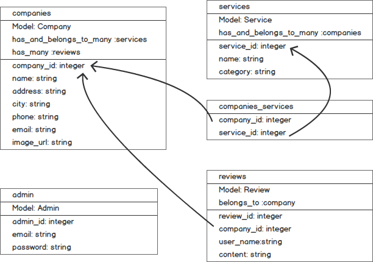
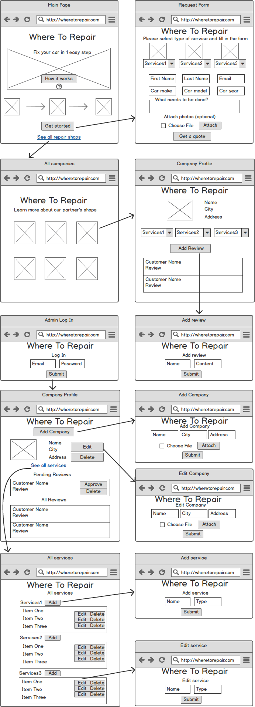

# WHERE TO REPAIR

### Description

 Where To Repair is a full stack Ruby on Rails app, that will help you get the best quote for car repair in 1 easy step. Just fill in the form, tell us what service do you need and we will contact our partners to get the best price for you. There is also an admin account to maintain companies database.

### Entity Relationship Diagram

### Wireframes

 

### User Stories

  [Trello](https://trello.com/b/TSNjVYUQ/where-to-repair#)

### Technologies used

 + Ruby on Rails
 + PostgreSQL
 + Materialize
 + jQuery
 + Mailer gem

### Planned features

 + Ratings(reviews) gem
 + Social share button
 + Google maps gem
